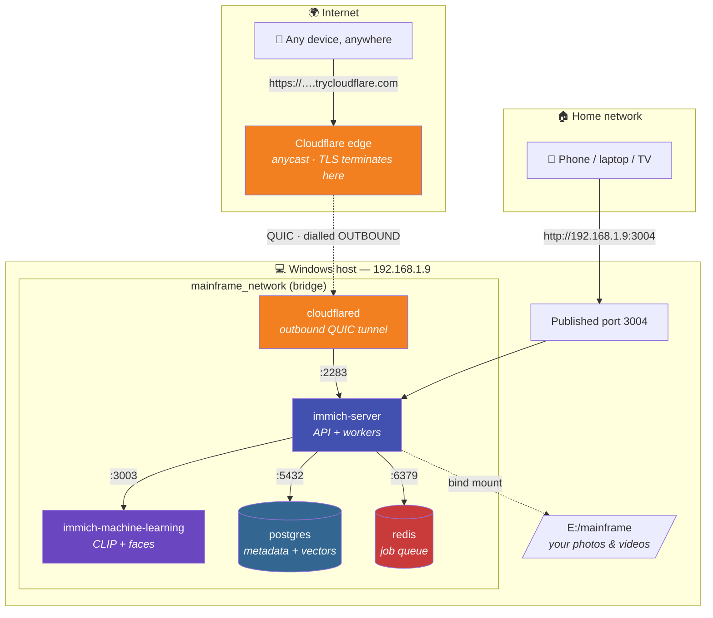

# 🗄️ Mainframe

**A self-hosted photo and video library, on your own drive.**

Mainframe is a Docker Compose stack that runs [Immich](https://immich.app) — an open-source, self-hosted alternative to Google Photos — on a Windows host. Your media stays on your own disk, indexed by a local database and searchable through on-device machine learning.

Storage and compute are entirely local. Remote access is optional and off by default in spirit — but this stack **does** currently ship a Cloudflare tunnel that publishes the web UI to the internet. See [Remote access](#remote-access) for exactly what that exposes.


---

## Contents

- [What's in the box](#whats-in-the-box)
- [Architecture](#architecture)
- [Configuration](#configuration)
- [Where your data lives](#where-your-data-lives)
- [Quick start](#quick-start)
- [Accessing Mainframe from other devices](#accessing-mainframe-from-other-devices)
- [Remote access](#remote-access)
- [Everyday operations](#everyday-operations)
- [Backups](#backups)
- [Troubleshooting](#troubleshooting)
- [Upgrading](#upgrading)
- [Hardening notes](#hardening-notes)

---

## What's in the box

Five containers on one private bridge network. Only one publishes a host port — but the tunnel gives a second one a route in from the internet.

| Service | Container | Image | Exposed | Job |
|---|---|---|---|---|
| `immich-server` | `mainframe_immich_server` | `ghcr.io/immich-app/immich-server:release` | **`3004` → `2283`** | Web UI, REST API, and the background worker that ingests and transcodes media |
| `immich-machine-learning` | `mainframe_immich_ml` | `ghcr.io/immich-app/immich-machine-learning:release` | internal only | CLIP embeddings for smart search, plus face detection and recognition |
| `postgres` | `mainframe_postgres` | `ghcr.io/immich-app/postgres:16-vectorchord0.4.3-pgvector0.8.0` | internal only | All metadata, accounts, and the vector index that powers search |
| `redis` | `mainframe_redis` | `valkey/valkey:8-alpine` | internal only | Job queue between the API and the background workers |
| `cloudflared` | `mainframe_cloudflared` | `cloudflare/cloudflared:latest` | no host port; **outbound tunnel** | Publishes `immich-server:2283` on a public `trycloudflare.com` URL |

> ⚠️ The published port is **`3004` on the host**, mapped to `2283` inside the container. Immich's own docs and most upstream examples use `2283` on both sides — every URL in this README uses `3004` deliberately. The container-internal port is still `2283`, which is why `cloudflared` and the ML service address it that way.

`cloudflared` opens no listening port. It dials *out* to Cloudflare's edge and serves requests back down that connection, so it needs no firewall rule and no port forwarding. That also means it is reachable from the internet the moment the stack is up — see [Remote access](#remote-access).

The database image is Immich's own Postgres build, not stock Postgres. It ships the **VectorChord** (`vchord`) and **pgvector** (`vector`) extensions, and Immich refuses to start without one of them. See [No vector extension found](#-no-vector-extension-found) for why this matters more than it sounds.

---

## Architecture



The dotted edge → `cloudflared` arrow points *backwards* on purpose: Cloudflare never connects to your machine. `cloudflared` establishes that connection outbound and Cloudflare pushes requests down it.

**Service names are load-bearing.** Containers find each other by Docker's internal DNS, which resolves the *service* name and the *container_name* — nothing else. Three names must stay in agreement:

| Consumer | Setting | Must match |
|---|---|---|
| `immich-server` | `DB_HOSTNAME` in `.env` | the `postgres:` service key in `docker-compose.yml` |
| `immich-server` | `REDIS_HOSTNAME` in `.env` | the `redis:` service key |
| `immich-server` | *(default)* `http://immich-machine-learning:3003` | the `immich-machine-learning:` service key |

Rename a service and you must update its partner, or you get the failure in [ENOTFOUND](#-getaddrinfo-enotfound-postgres). The ML service has no matching `.env` variable because Immich hardcodes a default — if you ever rename it, set `IMMICH_MACHINE_LEARNING_URL` explicitly.

---

## Configuration

Everything tunable lives in `.env`, which is loaded two ways: `env_file` hands it to the Immich containers as environment variables, and Compose interpolates `${...}` references inside `docker-compose.yml`.

| Variable | Current value | What it controls |
|---|---|---|
| `UPLOAD_LOCATION` | `E:/mainframe` | Host folder bind-mounted to `/usr/src/app/upload`. **This is your media library.** |
| `DB_HOSTNAME` | `postgres` | Hostname the server dials for Postgres |
| `DB_USERNAME` | `postgres` | Postgres role — also becomes `POSTGRES_USER` at cluster creation |
| `DB_PASSWORD` | `password` | Postgres password — see [Hardening notes](#hardening-notes) |
| `DB_DATABASE_NAME` | `immich` | Database name — also becomes `POSTGRES_DB` |
| `REDIS_HOSTNAME` | `redis` | Hostname the server dials for the job queue |

Optional variables worth knowing about, none of which are set today:

| Variable | Effect |
|---|---|
| `DB_VECTOR_EXTENSION` | Forces `vchord` or `vector` instead of letting Immich autodetect. Set this only to pin behaviour deliberately. |
| `IMMICH_MACHINE_LEARNING_URL` | Overrides the ML service address. Needed if you rename or externalize that container. |
| `TZ` | Container timezone. Currently inherited from the host via the `/etc/localtime` mount. |

> ⚠️ **The `POSTGRES_*` variables only take effect on an empty data volume.** They are read by `initdb` the first time the cluster is created and ignored on every start after that. Changing `DB_PASSWORD` in `.env` does **not** change the password of an existing database — you have to `ALTER USER` it in SQL, or delete the volume and start over.

---

## Where your data lives

Four distinct places, with very different consequences if lost.

| What | Where | Backed by | If you delete it |
|---|---|---|---|
| **Photos & videos** | `E:/mainframe` on the host | bind mount | 💀 Irreplaceable. This is the actual library. |
| **Accounts & metadata** — users, password hashes, sessions, API keys, albums, faces, search vectors | `mainframe_pgdata` volume | named volume | 😖 Media survives, but every account, album, and share link is gone and the library must be re-imported |
| **ML models** | `mainframe_model-cache` volume | named volume | 😌 Harmless — re-downloaded on demand |
| **Server settings** | inside Postgres | *(see above)* | Covered by the database |

**Authentication data is entirely in Postgres**, not in a config file and not on the media drive. User records, hashed passwords, active sessions, and API keys all live in the `immich` database inside the `mainframe_pgdata` volume. Two things follow from that:

- Wiping the database volume logs everyone out permanently and forgets all accounts, even though every photo is still sitting safely on `D:`.
- A backup that copies only `E:/mainframe` is **not** a full backup. See [Backups](#backups).

Inspect the volumes anytime:

```bash
docker volume ls --filter name=mainframe
docker volume inspect mainframe_pgdata
```

---

## Quick start

**Prerequisites** — Docker Desktop for Windows (WSL2 backend), and enough free space on `E:` for the library plus roughly 2 GB for models and database.

```bash
cd E:/draft/mainframe

# Start everything, detached
docker compose up -d

# Watch it come up
docker compose logs -f immich-server
```

First boot takes a few minutes: Postgres runs `initdb`, Immich installs the vector extension and applies its schema migrations, and the ML container fetches models on first use.

**Expect some noise on startup.** `depends_on` here waits only for containers to *start*, not for Postgres to be *ready to accept connections*, so `immich-server` will typically fail and restart once or twice before the database is listening. `restart: always` recovers it automatically. You'll know it's healthy when the log settles and this reports `healthy`:

```bash
docker compose ps
```

Then open **<http://localhost:3004>** and create the admin account. The first account registered becomes the administrator.

> ⚠️ **The tunnel is live from the first `up`.** `cloudflared` starts alongside everything else, so the public URL exists *before* you have created an admin account. Whoever loads it first gets the admin registration screen. Create your account immediately, or comment out the `cloudflared` service until you have.

<details>
<summary><b>Optional:</b> silence the startup crash loop with a health gate</summary>

Add a healthcheck to the `postgres` service and make the server wait for it:

```yaml
  postgres:
    # ...existing config...
    healthcheck:
      test: ["CMD-SHELL", "pg_isready -U ${DB_USERNAME} -d ${DB_DATABASE_NAME}"]
      interval: 5s
      timeout: 5s
      retries: 10

  immich-server:
    depends_on:
      redis:
        condition: service_started
      postgres:
        condition: service_healthy
```

Purely cosmetic — the stack works without it — but it makes real failures easier to spot, because a restart loop stops being normal background noise.
</details>

---

## Accessing Mainframe from other devices

Any phone, laptop, or TV on the same network reaches Mainframe at:

```
http://192.168.1.9:3004
```

For the **Immich mobile app**, put that URL in the *Server Endpoint* field — the app appends `/api` itself. If it rejects the address, enter `http://192.168.1.9:3004/api` explicitly.

**Prefer the LAN address for uploads.** It is faster than the tunnel and has no request-size limit, which matters for large videos — see [the 100 MB cap](#limits-you-will-actually-hit).

### Why this works without a firewall rule

Host networking:

| Check | Value |
|---|---|
| Host LAN address | `192.168.1.9` (Ethernet 2, /24) |
| Listener | `0.0.0.0:3004` — all interfaces, not just loopback |
| Firewall rule | `Docker Desktop Backend` → **Allow**, profile **Public** |
| Ethernet network category | **Public** — matches the rule |

Docker Desktop's firewall rule is *program-based*, granted to `com.docker.backend` rather than to port 2283, which is why searching the firewall for a 2283 rule turns up nothing while inbound traffic still works.

### Two ways this quietly breaks

> ⚠️ **Do not set this network to "Private."** The Docker rule covers the **Public** profile only. Flipping the category — normally the safer choice on a home LAN — stops matching that rule and cuts off LAN access until you add an equivalent Private rule. This is the counterintuitive one.

> ⚠️ **`192.168.1.9` is DHCP-assigned** and can move after a lease renewal or reboot, breaking every saved URL. Pin it with a DHCP reservation on the router, or give the host a static address.

---

## Remote access

The `cloudflared` service publishes the web UI on the public internet over a **Cloudflare quick tunnel**. No account, no domain, no port forwarding.

```yaml
cloudflared:
  container_name: mainframe_cloudflared
  image: cloudflare/cloudflared:latest
  command: tunnel --no-autoupdate --url http://immich-server:2283
  depends_on: [immich-server]
  restart: always
  networks: [mainframe_network]
```

### Finding the current URL

The hostname is assigned by Cloudflare at startup and printed once to the logs:

```bash
docker compose logs cloudflared | grep trycloudflare.com
```
```powershell
docker compose logs cloudflared | Select-String trycloudflare.com
```

### 🔴 The URL is disposable

**A new hostname is issued every time the `cloudflared` process starts.** It is stable while running — it will not rotate under you mid-session — but it does not survive:

- a machine reboot
- a Docker Desktop restart or update
- `docker compose up` / `down` / `restart`
- the container crashing (`restart: always` brings it back as a *new* tunnel)

Cloudflare does not let you reserve a quick-tunnel name. Any link you share dies at the next restart, and nothing warns you — the old hostname simply stops resolving. Re-read the logs after any of the above.

The only fix is a **named tunnel**, which requires a domain on Cloudflare (free plan is fine) and a one-time `cloudflared login`. That gives a hostname that persists indefinitely and can sit behind Cloudflare Access so it is not open to the whole internet.

### Limits you will actually hit

| Limit | Consequence |
|---|---|
| **100 MB request body** (Cloudflare free plan) | Uploading a large video *through the tunnel* fails. Do bulk and video uploads over the LAN at `http://192.168.1.9:3004`. |
| **TLS terminates at Cloudflare** | Cloudflare can read your traffic in plaintext — logins, session cookies, photos. Inherent to any reverse-proxy tunnel; a named tunnel changes who can *reach* it, not who can *see* it. |
| **Quick tunnels are best-effort** | Explicitly disposable infrastructure with no uptime guarantee. Fine for sharing; not something to depend on. |

### Set the external domain

After the URL changes, update **Admin → Settings → Server → External Domain** to match. Otherwise shared album links generate against `localhost:3004` and are dead for anyone outside the host.

### Why not localtunnel

An earlier revision of this stack used [localtunnel](https://github.com/localtunnel/localtunnel) (`*.loca.lt`). **It could not serve Immich** and was replaced. Recorded here so it does not get retried — see [Tunnel returns 502 / 408](#-tunnel-returns-502--408-and-the-ui-hangs) for the diagnosis.

---

## Everyday operations

```bash
# Status of all five containers
docker compose ps

# Current public tunnel URL
docker compose logs cloudflared | grep trycloudflare.com

# Follow logs — all services, or just one
docker compose logs -f
docker compose logs -f immich-server

# Restart a single service
docker compose restart immich-server

# Stop everything, keeping all data
docker compose down

# Pick up an .env change (env vars are baked in at container creation)
docker compose up -d --force-recreate immich-server

# Open a SQL shell
docker exec -it mainframe_postgres psql -U postgres -d immich

# Shell inside the server container
docker exec -it mainframe_immich_server sh

# Disk usage of the stack
docker system df -v | grep mainframe

# Take the site off the internet without touching the rest of the stack
docker compose stop cloudflared
```

`docker compose down` is safe: it removes containers but leaves named volumes and your media alone. The destructive variant is `down -v`, which deletes `mainframe_pgdata` and `mainframe_model-cache` — see the warning in [Where your data lives](#where-your-data-lives).

---

## Backups

A complete backup is **two** things. Missing either one makes recovery painful or impossible.

**1. The database** — accounts, albums, and all metadata:

```bash
docker exec -t mainframe_postgres pg_dumpall --clean --if-exists -U postgres \
  > "D:/backups/mainframe-db-$(date +%Y%m%d).sql"
```

**2. The media** — everything under `UPLOAD_LOCATION`. Use whatever file-level tool you already trust (robocopy, Restic, a NAS sync). The important part is that it covers `E:/mainframe` in full.

Restore is the reverse: bring up a fresh stack, restore the media folder, then pipe the dump back in:

```bash
cat mainframe-db-YYYYMMDD.sql | docker exec -i mainframe_postgres psql -U postgres -d postgres
```

> ℹ️ Back up the SQL **dump**, not the `pgdata` volume directory. A file-level copy of a running Postgres data directory is not crash-consistent and may restore to a corrupt cluster.

---

## Troubleshooting

### ❌ `getaddrinfo ENOTFOUND postgres`

```
Error: getaddrinfo ENOTFOUND postgres
    at GetAddrInfoReqWrap.onlookupall [as oncomplete] (node:dns:122:26) {
  errno: -3008, code: 'ENOTFOUND', syscall: 'getaddrinfo', hostname: 'postgres'
}
```

**Cause.** `DB_HOSTNAME` names a host that Docker's DNS can't resolve. A container answers to its **service name** and its **container_name** — nothing else. If the service key is `database` while `.env` says `postgres`, the lookup returns NXDOMAIN and Node dies on the unhandled rejection, producing an endless restart loop.

**Diagnose.** Ask Docker what names the database actually answers to, then compare against what the server is asking for:

```bash
docker inspect mainframe_postgres \
  --format '{{range $k,$v := .NetworkSettings.Networks}}{{$v.DNSNames}}{{end}}'

docker exec mainframe_immich_server printenv | grep -E "^DB_|^REDIS_"
```

**Fix.** Make the two agree — either rename the service or point `DB_HOSTNAME` at the existing name — then **recreate** the container. A plain `restart` is not enough, because environment variables are fixed at creation time:

```bash
docker compose up -d --force-recreate immich-server
```

The same logic applies to `REDIS_HOSTNAME` and to `IMMICH_MACHINE_LEARNING_URL`.

### ❌ `No vector extension found`

```
Error: No vector extension found. Available extensions: vchord, vector
```

**This message is misleading.** `vchord, vector` is not a list of what your database has — it's Immich's list of what it *supports*, printed straight from its own constants:

```js
throw new Error(`No vector extension found. Available extensions: ${VECTOR_EXTENSIONS.join(', ')}`)
```

**Cause.** The Postgres image doesn't provide either supported extension. The classic case is a pre-v2-era compose file pinning `tensorchord/pgvecto-rs`, which supplies `vectors` (pgvecto-rs) — a backend Immich has since dropped — while `immich-server:release` keeps upgrading itself. The server outgrows the database.

**Diagnose.** Ask Postgres directly what it can offer:

```bash
docker exec mainframe_postgres psql -U postgres -d immich \
  -c "select name, default_version, installed_version
      from pg_available_extensions where name in ('vchord','vector','vectors');"
```

Seeing only `vectors` confirms it.

**Fix.** Use Immich's own Postgres image, as this stack now does:

```yaml
image: ghcr.io/immich-app/postgres:16-vectorchord0.4.3-pgvector0.8.0
```

⚠️ **Swapping the image is not sufficient on an existing cluster.** VectorChord must be listed in `shared_preload_libraries`, and the image writes that configuration only during first-time cluster initialization. Point it at a volume that some *other* image already ran `initdb` on and the setup step is skipped, so the extension still fails to load. On a fresh install with nothing to lose, recreate the volume:

```bash
docker compose down
docker volume rm mainframe_pgdata   # ⚠️ destroys all accounts and metadata
docker compose up -d
```

Confirm the database is genuinely empty first — if this returns `0`, there is nothing to lose but do check:

```bash
docker exec mainframe_postgres psql -U postgres -d immich \
  -tAc "select count(*) from information_schema.tables where table_schema='public';"
```

If the database *does* hold a real library, do not delete the volume — follow Immich's documented pgvecto-rs → VectorChord migration instead.

### ❌ Reachable from the host but not from other devices

Port 3004 accepts the connection and then drops it, which looks like a hang rather than a clean refusal. Almost always one of:

1. **The server is crash-looping.** Docker's port proxy holds 3004 open even with nothing behind it. Check `docker compose ps` and the logs before suspecting the network.
2. **Network profile flipped to Private.** See [the warning above](#two-ways-this-quietly-breaks).
3. **The host's IP changed.** Re-check with `Get-NetIPAddress -AddressFamily IPv4`.

### ❌ The public URL stopped working

Almost certainly the quick tunnel was reissued. Confirm by comparing the container's start time against the URL you were given:

```bash
docker inspect mainframe_cloudflared --format 'RestartCount={{.RestartCount}} StartedAt={{.State.StartedAt}}'
docker compose logs cloudflared | grep trycloudflare.com
```

A dead quick-tunnel hostname stops resolving entirely — `curl` exits with code 6 (*could not resolve host*) rather than returning an HTTP error. That is the tell: DNS failure means the tunnel is gone, not that Immich is down. See [The URL is disposable](#-the-url-is-disposable).

### ❌ Tunnel returns 502 / 408 and the UI hangs

**Symptom.** The tunnel URL loads partially or spins forever. The API answers simple requests, but the web UI never finishes booting. Direct access on `http://localhost:3004` is instant and healthy.

**This is what killed localtunnel on this stack**, recorded so the trap isn't re-entered. Measured against `/api/server/ping`, a 14-byte response:

| | localtunnel | cloudflared | direct |
|---|---|---|---|
| 6 sequential | **0/6** — 502, 408, 408, 502, 502, 502 | 6/6, 0.13–1.16 s | — |
| 8 parallel | 7/8, up to 4.7 s, one hung past 25 s | **8/8**, 0.14–0.25 s | — |
| Root HTML | 408 | 200, 10 KB in 0.44 s | 200 in **7 ms** |

**Cause.** localtunnel gives the relay a **pool of ~10 TCP sockets**, one consumed per HTTP request, and the CLI exposes no flag to enlarge it. Immich's SvelteKit frontend requests 40+ JS chunks on first load. The pool empties, every request past the tenth gets a 408 with no socket to ride on, and a single 502'd chunk breaks the SPA — so the page never finishes.

**Diagnose.** An exhausted pool is visible directly. Healthy means at least one `ESTABLISHED` connection to the relay; all-`FIN_WAIT2` with none established means starved:

```bash
docker exec <tunnel-container> sh -c "netstat -tn"
```

**Fix.** Use a tunnel that multiplexes instead of pooling. `cloudflared` runs a single QUIC connection (`ha-connections:1`) and makes each request a *stream* inside it — streams are essentially free, so there is no pool to exhaust and no head-of-line blocking between concurrent chunks. Confirm the protocol actually negotiated:

```bash
docker compose logs cloudflared | grep -E "Registered tunnel connection|Initial protocol"
```

Expect `protocol=quic`. If it fell back to `http2`, the tunnel still works — UDP egress is likely blocked on your network.

### 🔍 General triage order

```bash
docker compose ps                          # is it even running?
docker compose logs --tail 50 immich-server # what did it say on the way down?
docker exec mainframe_postgres pg_isready -U postgres   # is the DB accepting connections?
docker exec mainframe_immich_server printenv | grep ^DB_ # is it configured as intended?
```

---

## Upgrading

All three Immich images track `:release`, so an upgrade is a pull away:

```bash
docker compose pull
docker compose up -d
```

Schema migrations run automatically on first boot of the new version.

> ⚠️ **Take a database dump before upgrading.** Migrations are one-way; there is no downgrade path once the schema has moved forward.
>
> ⚠️ **`:release` is a moving target.** The `ENOTFOUND` and vector-extension failures above were both caused by the server drifting ahead of a pinned dependency. Read Immich's release notes before major version jumps — especially anything touching the database image — or pin the server to an explicit version tag so upgrades happen when *you* choose.

---

## Hardening notes

Known-weak spots in the current setup, roughly worst first:

| ⚠️ | Issue | Why it matters | Fix |
|---|---|---|---|
| 🔴 | **`.env` is committed to git** | The file is tracked and contains `DB_PASSWORD` in plaintext. There is no `.gitignore` in this repository. Anyone with the repo has the credential, and it stays in history after any later fix. | `git rm --cached .env`, add a `.gitignore` covering it, commit a `.env.example` with placeholder values instead. Rotate the password — scrubbing history does not un-leak it. |
| 🔴 | **The library is on the public internet** | `cloudflared` runs with `restart: always`, so the tunnel comes back on every boot. The only thing between a stranger with the URL and every photo is the Immich login form. Quick-tunnel hostnames are random, but that is obscurity, not access control. | Use a strong admin password and disable public registration. For real control, move to a named tunnel behind Cloudflare Access, or `docker compose stop cloudflared` when not needed. |
| 🔴 | `DB_PASSWORD=password` | Trivially guessable. Postgres isn't published to the LAN, so the exposure is limited to anything already running on this host or inside the Docker network — but it's still a plaintext credential in a file. | Set a strong value **before** the first `up`, while `initdb` can still apply it. On an existing cluster, `ALTER USER postgres WITH PASSWORD '…'` and update `.env` to match. |
| 🟠 | Cloudflare sees plaintext | TLS terminates at the edge, not on this host, so the tunnel operator can read logins and media. | Unavoidable with any reverse-proxy tunnel. Use Tailscale or a VPN if the traffic must not be readable by a third party. |
| 🟠 | No TLS on port 3004 | Logins and photos cross the LAN unencrypted. Acceptable on a trusted network, unsafe anywhere else. | Reverse proxy with HTTPS, or reach it over a VPN. |
| 🟡 | Network category is Public | Windows applies stricter defaults, which is fine — but the Docker rule is Public-only, so the safer-looking change is the one that breaks access. | Leave as-is unless you add a matching Private rule. |
| 🟡 | Volume-only database durability | A corrupt volume takes every account and album with it. | Scheduled `pg_dumpall`, per [Backups](#backups). |

---

## Reference

- [Immich documentation](https://immich.app/docs) — features, mobile apps, external libraries
- [Immich Docker Compose reference](https://immich.app/docs/install/docker-compose) — upstream compose file to diff against
- [Immich backup and restore](https://immich.app/docs/administration/backup-and-restore)
- [VectorChord](https://github.com/tensorchord/VectorChord) — the vector index behind smart search
- [Valkey](https://valkey.io) — the Redis fork used for the job queue
- [Cloudflare Tunnel](https://developers.cloudflare.com/cloudflare-one/connections/connect-networks/) — quick tunnels, named tunnels, and Access

---

<div align="center">
<sub>Mainframe · self-hosted, local-first, no cloud in the loop</sub>
</div>
